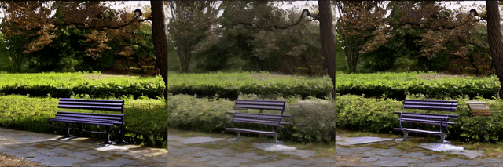
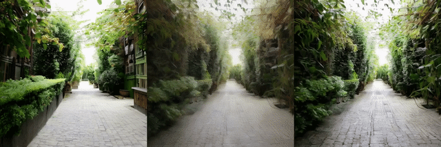

<div align="center">

# D2Cache: Second-Order Delta Caching for Higher Video Diffusion Acceleration

**CVPR 2026**

[Enhuai Liu](mailto:eliu0719@uni.sydney.edu.au), Yunke Wang, Changming Sun, Chang Xu

The University of Sydney · CSIRO

[[Paper]](./d2cache.pdf) <!-- [[arXiv]]() --> <!-- [[Project Page]]() -->

</div>

---

## 📢 News

- **[2026-03]** D2Cache is accepted by **CVPR 2026**!
- **[2026-03]** Code and paper are released.

---

## Abstract

Video diffusion models are accurate but expensive at inference time because denoising is applied sequentially over many timesteps. Caching methods reuse computations across timesteps and often extrapolate from **first-order residuals** (differences between adjacent predictions). We propose **D2Cache**, a **training-free** plug-in that exploits the smoothness of **second-order residual deltas**—temporal differences between consecutive first-order residuals—to predict skipped steps more accurately and curb error accumulation. We further **adaptively scale** second-order terms using signals from timestep embeddings. Across several video diffusion backbones, D2Cache improves quality–latency trade-offs compared with strong first-order caching baselines (e.g., TeaCache), with larger gains under aggressive acceleration.

---

## 🔥 Highlights

- **Second-order delta caching** for diffusion inference: reuse and correct predictions using second-order residual with dynamic scaling, beyond standard first-order residual caching.
- **Empirical evaluation** on multiple video diffusion models and benchmarks, showing consistent gains especially under high speedup.
- **Training-free plug-in:** no additional training or fine-tuning required.

---

## 🏗️ Repository Layout

```
D2Cache/
├── D2Cache4Wan2.1/      # Integration with Wan2.1 (text-to-video)
├── D2Cache4Videosys/     # VideoSys-based implementations for Latte and Open-Sora
├── D2Cache4LTX-Video/    # Integration with LTX-Video
├── showcases/            # Qualitative comparison videos
└── d2cache.pdf           # Camera-ready paper PDF
```

| Directory | Description | Paper Section |
|-----------|-------------|---------------|
| [`D2Cache4Wan2.1/`](./D2Cache4Wan2.1/) | **Wan2.1** text-to-video integration; drop-in generation script | Sec. 4.1 |
| [`D2Cache4Videosys/`](./D2Cache4Videosys/) | **Latte** and **Open-Sora** via VideoSys; VBench evaluation scripts | Sec. 4.2-4.3 |
| [`D2Cache4LTX-Video/`](./D2Cache4LTX-Video/) | **LTX-Video** integration; large-scale VBench generation | Sec. 4.4 |

Each subdirectory contains its own `README.md` with environment setup and detailed commands.

---

## 🚀 Getting Started

D2Cache is a **training-free** plug-in. Install the original repository first, then copy our scripts into your workspace.

### 1. Wan2.1 (Text-to-Video)

1. Install **Wan2.1**: [https://github.com/Wan-Video/Wan2.1](https://github.com/Wan-Video/Wan2.1)
2. Copy `D2Cache4Wan2.1/delta2cache_generate.py` into your Wan2.1 workspace.
3. Run inference:

```bash
python delta2cache_generate.py \
  --task t2v-1.3B \
  --size 832*480 \
  --ckpt_dir ./Wan2.1-T2V-1.3B \
  --prompt "Two anthropomorphic cats in comfy boxing gear and bright gloves fight intensely on a spotlighted stage." \
  --base_seed 42 \
  --teacache_thresh 0.24 \
  --teacache_mode delta_delta
```

The flag `--teacache_mode delta_delta` selects the D2Cache second-order caching path.

### 2. Latte & Open-Sora (VideoSys)

1. Install **VideoSys**: [https://github.com/NUS-HPC-AI-Lab/VideoSys](https://github.com/NUS-HPC-AI-Lab/VideoSys)
2. Copy scripts from `D2Cache4Videosys/` into your VideoSys workspace.
3. Run inference:

```bash
python latte_delta2.py
python opensora_delta2.py
```

### 3. LTX-Video

1. Install **LTX-Video**: [https://github.com/Lightricks/LTX-Video](https://github.com/Lightricks/LTX-Video)
2. Copy scripts from `D2Cache4LTX-Video/` into your LTX-Video workspace.

See each subdirectory's `README.md` for detailed instructions.

---

## 📊 Evaluation

### VBench Metrics

```bash
cd D2Cache4Videosys

# Compute per-metric scores
python vbench/run_vbench.py --video_path <path_to_videos> --save_path <score_output_dir>

# Aggregate results
python vbench/cal_vbench.py --score_dir <score_output_dir>
```

---

## 🎬 Qualitative Comparisons

The videos below compare **default inference**, **TeaCache (superfast)**, and **D2Cache (superfast)** under matched caching schedules. Reported speedups are from our paper's experimental setup; see the paper for full settings and metrics.

### Wan2.1 (≈3.63× speedup)


### Latte (≈3.62× speedup)




### Open-Sora (≈2.86× speedup)


---

## 📝 Citation

If you find this work useful, please cite:

```bibtex
@inproceedings{liu2026d2cache,
  title     = {D2Cache: Second-Order Delta Caching for Higher Video Diffusion Acceleration},
  author    = {Liu, Enhuai and Wang, Yunke and Sun, Changming and Xu, Chang},
  booktitle = {Proceedings of the IEEE/CVF Conference on Computer Vision and Pattern Recognition (CVPR)},
  year      = {2026}
}
```

> **Note:** Update `pages`, `doi`, and `url` fields once the official proceedings metadata is available.

---

## 🙏 Acknowledgements

This work was supported in part by the Australian Research Council under Projects **DP240101848** and **FT230100549**.

---

## 📄 License

This project is released under the [MIT License](./LICENSE).

---

## 📧 Contact

For questions about the code or paper:
- Open an [issue](https://github.com/username/D2Cache/issues) in this repository
- Email the authors (see addresses above)
